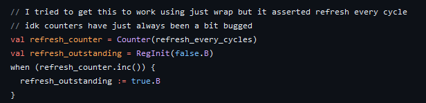

## Layout of Presentation

- Introduction to Memories
- Why generate controllers?
- Memory Model Internals
- Finite State Machine Internals
- Challenges up to this point
- Future Work

## Introduction to memories

- Humans need to remember things: names, faces, dates, tasks
- Computers need to remember things too: previous computations states
- Different types of memory cells: SRAM(bottom), DRAM(top), flash(not pictured)

---

### DRAM Memory

---

### SRAM Memory Cell

---

### What is SDRAM?

- Synchronous dynamic random access memory
- Controlled by an external clock
  - Only uses 1 edge
- Allows for data from SDRAM to join the pipeline of other instructions for efficient use and faster processing

---

### SDRAM Module

### Communication to Memory

- Accessing memory is not as simple as giving an address
- User must respect several timing characteristics
- Data retrieval likely is not instantaneous and would need to wait
- Read data may be garbage until a certain number of cycles pass

---

### Communication to Memory Example

 cycles
- Runtime adjustable CAS; 1-3 cycles
  - Implemented with variable shift register
- Read-write masking
- Parameterized banks, rows, cols, refresh timer
- Tri-state data pins! (Or at least, it’s supposed to)

## Pinout

## MT48LC1M16A1 Functional Diagram

## Hardware Parameters and IO

|       Parameters        |         SDRAM IO         |
| :---------------------: | :----------------------: |
|  |  |

## Finite State Machine

### Finite State Machine Internals

---

### Initialization State

---

### Idle State

---

### Active State

---

### Reading/Writing State

|       Read        |       Write        |
| :---------------: | :----------------: |
|  |  |

---

### Refreshing 1

---

### Refreshing 2

|       From Idle        |       From Active        |
| :--------------------: | :----------------------: |
|  |  |

Don’t interrupt read or write; try to refresh 2 cycles early.
No manual refresh…

## Results

### CAS Latency of 3

---

### CAS Latency of 2

---

### CAS Latency of 1

## Presets

- Add more versatility to controller
  - May break compatibility with sample memory model if modified too much
- Includes activate, refresh, and write timings
  - Parameterized into cycles

---

### Preset Example

## Closing the Loop

### Controller

- Basic FSM transitions
- Row active delay
- Memory model initialization
- Read/Write states
- CAS Latency
- Refreshing
- Presets

---

### Memory Model

- Basic activate->read/write->precharge loop (no delay)
- Burst read/write
- CAS Latency
- Write masking
- Refresh

## Challenges

- Chisel 3.6 does not have good support for tri-state/inout pins
  - BlackBox incompatible with ChiselTest
    - Requires Verilog testbenches and simulators such as Verilator and iVerilog
  - Analog conditional connections not allowed yet every single Verilog SDRAM controller does this
    - Maybe it doesn’t like last connection semantics?
  - Made masking difficult to implement
    - I’m not sure this would actually work in hardware…
  - Also doesn’t really support edge-triggered everything, but that’s not really a problem
- Size of real memory chip is somewhat large
  - Causes SBT to run out of memory when fully emulated
- Need to know clock rate to properly emulate decay/activate latency
  - And some other things about the memory that we aren’t emulating
  - Such as row activation latency, write-after-read bus coherency

## Future Work and Current Status

- For the end of this class
  - More tests - 7 tests total (4 for Model, 3 for FSM)
  - Include a refresh command - currently only done in initialization - Done
  - Maybe basic Github Actions - Done
  - Main program to generate Verilog - Done
- Far Future
  - Other memory models? - Supported?
    - This implementation is kind of specific
  - Support burst reads and writes - Done
  - Support more complicated workload loads
  - Allow for multiple channels and internal scheduling
  - Formal Verification?

## What We Learned from CSE 228A

- For Datasheet reading, each operation’s section will show the applicable timing constraint
  - Active cares about t_rcd, Write cares about t_wr, Read cares about CAS latency
- Targeting multiple SDRAM modules is a cool idea for a parameter
  - But a single SDRAM has so many options for parameters on its own that each one can likely be a CSE 228A final project on its own
- Experimental features are not fun to use
  - Very little documentation from others using these features leaves us to play around with code more that we would like to

## Advice for the Future Students

- Reusing code is always better than making your own
  - Our JSON parser is a library we found, we just create a Map to represent our datasheet from the JSON file
- Avoid Experimental Libraries unless necessary
  - If for whatever reason we need to update Chisel, our Analog functionality may need a rewrite
- Learn Git and version control
  - Our usage of branches isolated our development and we did not have to deal with weird merge conflicts which is common in CSE 101 and 130

## Calls for Contributions and Questions

- No tool installation required due to Github Codespaces!
  Inline Verilog attempted - see commit e58cd19
  - But it broke the tests so it was commented out
